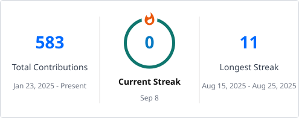

<h1 align="center">Dhruv Verma</h1>
<h3 align="center">Backend systems, ML tooling, product builds, and competitive problem solving.</h3>

  
  
  

  

## About Me

- Final-year Electrical and Electronics Engineering student at `ABV-IIITM Gwalior` `(2023-2027)`.
- Worked as a `Software Intern at Curefit`, focused on backend-heavy CSAT journeys, integrations, and invoice-system exploration.
- I like systems with real moving parts: async workflows, APIs, commerce tooling, ML pipelines, and product-facing engineering.
- My public work spans `backend systems`, `Python tools`, `TypeScript apps`, `ML experiments`, and `competitive programming`.

## Current Focus

- Building and refining product-style projects like `ChessFlow`, `IntentLens`, and `Study Buddy`.
- Working across `Java`, `Spring Boot`, `TypeScript`, `Python`, and data/ML tooling.
- Practicing problem solving on `LeetCode`, `Codeforces`, and `CodeChef`.
- Interested in `AI hardware acceleration`, `commerce backend systems`, and clean user-facing engineering.

## Tech Stack

### Languages

### Frameworks and Tools

### ML and Systems

## Featured Work

### `ChessFlow`
Python-based chess analysis tooling built around readability, positional clarity, and practical improvement loops instead of raw engine spam.  
Repo: [github.com/dhruvv1101/ChessFlow](https://github.com/dhruvv1101/ChessFlow)

### `portfolio`
A deliberate, editorial-style personal portfolio in `React + TypeScript` that presents projects, experience, and coding profiles with stronger visual identity.  
Repo: [github.com/dhruvv1101/portfolio](https://github.com/dhruvv1101/portfolio)

### `Kaggle: Student Health Risk`
Competition work using feature engineering, CatBoost, pseudo-labeling, and LightGBM with a best local balanced accuracy of `0.94994`.  
Dataset: [playground-series-s6e7](https://www.kaggle.com/competitions/playground-series-s6e7/data)

### `IntentLens`
A browser-extension concept around faster intent reading, context-awareness, and lower tab-switching overhead for users.  
Profile: [github.com/dhruvv1101](https://github.com/dhruvv1101)

## GitHub Stats

  
  

  

Generated inside this repository with GitHub Actions so the profile does not depend on flaky external image endpoints.

## Competitive Programming

- `LeetCode`: [ImpWevvB](https://leetcode.com/u/ImpWevvB/)
- `Codeforces`: [Dhruv83170](https://codeforces.com/profile/Dhruv83170)
- `CodeChef`: [msl_overflow](https://www.codechef.com/users/msl_overflow)

## Experience Snapshot

- `Curefit`:
  Worked on customer feedback flow logic, backend integrations, and invoice-system exploration with `Java`, `Spring Boot`, `Shopify`, `Uniware`, and async workflow concepts.
- `GirlScript Summer of Code`:
  Mentored contributors across reviews, structure, and implementation tradeoffs.
- `HAL Korwa`:
  Learned around avionics systems, manufacturing, testing, and reliability-oriented engineering.

## Connect

  
  
  

## One-Line Summary

> I build across backend flows, ML systems, and product-facing tooling, and I care about making technical work both real and usable.
